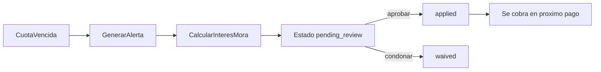

# Reglas de negocio y cálculo — Cartera24/7

Zona horaria: `America/Bogota`  
Moneda: **COP** (pesos enteros, redondeo half-up)

---

## 1. Creación de préstamo

- El prestamista crea el préstamo **directamente** (sin flujo de aprobación).
- **Sin plazo fijo en meses**: el préstamo termina cuando el saldo de capital llega a cero.
- Se congela un `LoanTerm` con: monto, tasa, frecuencia, reglas de mora.
- Al crear se genera solo la **primera cuota de interés** del periodo.
- Las cuotas siguientes se generan automáticamente según el saldo vigente (job diario o tras cada pago).
- El prestatario puede pagar **en cualquier fecha**: intereses devengados primero, excedente a capital.
- Se registra evento de desembolso en `LoanBalanceEvent`.

## 2. Cálculo de interés por ciclo

**Método principal: `interest_first_monthly`**

La **tasa** va amarrada a la **frecuencia de cobro**. No se convierte desde una tasa mensual:

```
interes_ciclo = redondear(saldo_capital * tasa)
```

Ejemplos con $1.000.000 y tasa **3%**:

| Frecuencia | Interés del ciclo |
|---|---|
| Diario | $30.000 (3% ese día) |
| Cada 15 días | $30.000 (3% esa quincena) |
| Mensual | $30.000 (3% ese mes) |
| Semanal | $30.000 (3% esa semana) |

### Ejemplo 1 — Interés sobre saldo

| Campo | Valor |
|---|---|
| Capital prestado | $1.000.000 COP |
| Tasa | 3% |
| Frecuencia | Mensual |
| Interés del ciclo | $30.000 COP |

### Ejemplo 1b — Misma tasa, cobro cada 15 días

| Campo | Valor |
|---|---|
| Capital prestado | $1.000.000 COP |
| Tasa | 3% |
| Frecuencia | Cada 15 días |
| Interés del ciclo | $30.000 COP |

### Ejemplo 1c — Misma tasa, cobro diario

| Campo | Valor |
|---|---|
| Capital prestado | $1.000.000 COP |
| Tasa | 3% |
| Frecuencia | Diario |
| Interés del ciclo | $30.000 COP |

Si el prestatario paga **el interés del ciclo**:
- ese monto → intereses
- $0 → capital
- Saldo capital: **$1.000.000**

### Ejemplo 2 — Pago mayor al interés (abono a capital)

| Campo | Valor |
|---|---|
| Saldo capital | $1.000.000 COP |
| Interés del ciclo | $30.000 COP |
| Pago recibido | $150.000 COP |

Asignación:
1. $30.000 → intereses
2. $120.000 → capital
3. Nuevo saldo capital: **$880.000 COP**

Interés del ciclo siguiente (si la tasa sigue en 3%): $880.000 × 3% = **$26.400 COP**

### Ejemplo 3 — Pago parcial (solo cubre parte del interés)

| Campo | Valor |
|---|---|
| Interés devengado | $30.000 COP |
| Pago recibido | $15.000 COP |

Asignación:
1. $15.000 → intereses (parcial)
2. Interés pendiente: $15.000 (se arrastra o se marca en cuota)
3. $0 → capital

## 3. Orden de asignación de pagos

```
1. Intereses pendientes (ciclos ya aplicables a la fecha)
2. Mora (solo si el prestamista decide cobrarla en ese pago)
3. Capital (excedente)
```

Implementado en `allocatePayment` / `PaymentsService`.  
Fuente de verdad del producto: `docs/ESTRUCTURA.md`.

## 4. Mora e interés adicional

### Detección
- Job diario revisa cuotas con `due_date < hoy` y estado `pending`/`partial`.
- Se crea `OverdueEvent` con días de mora.

### Cálculo (configurable por producto)

```
interes_mora = redondear(saldo_vencido * tasa_diaria_mora * dias_mora)
```

### Flujo de decisión



### Ejemplo mora

| Campo | Valor |
|---|---|
| Cuota vencida | $30.000 (interés) |
| Días de mora | 10 |
| Tasa diaria mora | 0,1% |
| Interés mora calculado | $3.000 COP |

El prestamista puede:
- **Aprobar** → se suma a próximo cobro
- **Condonar** → queda registrado en auditoría, no se cobra

## 5. Redondeo COP

- Todos los montos en enteros (sin decimales).
- Redondeo: `Math.round()` (half-up).
- Validación: montos siempre >= 0.

## 6. Estados de préstamo

| Estado | Descripción |
|---|---|
| `active` | Préstamo vigente con saldo |
| `paid_off` | Saldo capital = 0 |
| `defaulted` | En mora grave (configurable) |
| `cancelled` | Anulado antes de desembolso |

## 7. Estados de pago

| Estado | Visible prestatario |
|---|---|
| `pending` | No |
| `accepted` | Sí |
| `rejected` | No |
| `voided` | No |

## 8. Campos custom de prestatario

- Definidos por tenant en `BorrowerFieldDefinition`.
- Tipos: `text`, `number`, `date`, `select`, `boolean`.
- Validados en API al crear/actualizar prestatario.

## 9. Auditoría obligatoria

Eventos que generan `AuditLog`:
- Crear/anular pago
- Cambio de tasa de interés
- Modificación de saldo
- Condonación de mora
- Activación/desactivación de tenant
- Sesión de soporte/impersonación

Formato: `{ entity, action, oldValues, newValues, userId, tenantId, ip, timestamp }`
