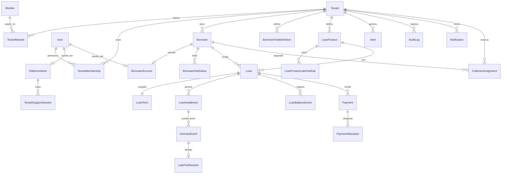

# Diagrama Entidad-Relación — Cartera24/7

## Vista general



## Capas del modelo

### 1. Plataforma
- `PlatformAdmin` — administradores globales de Cartera24/7
- `Tenant` — prestamista (organización)
- `Module` — catálogo de módulos activables
- `TenantModule` — módulos activos por tenant
- `TenantSupportSession` — impersonación/soporte con auditoría

### 2. Identidad y permisos
- `User` — credenciales globales
- `TenantMembership` — usuario ↔ tenant + rol
- `Permission` / `RolePermission` — RBAC
- `BorrowerAccount` — login de prestatario

### 3. Prestatarios
- `Borrower` — datos base + `customData` JSONB
- `BorrowerFieldDefinition` — campos custom por tenant
- `BorrowerFieldValue` — valores por prestatario

### 4. Crédito
- `LoanProduct` — plantilla de producto
- `LoanProductLateFeeRule` — reglas de mora
- `Loan` — préstamo activo
- `LoanTerm` — snapshot inmutable de condiciones
- `LoanInstallment` — cuotas/obligaciones
- `LoanBalanceEvent` — ledger de saldo

### 5. Pagos
- `Payment` — registro de pago manual
- `PaymentAllocation` — desglose interés / mora / capital
- `PaymentReceipt` — comprobantes adjuntos

### 6. Mora y alertas
- `OverdueEvent` — cuota vencida con interés calculado
- `LateFeeDecision` — aprobación/condonación
- `Alert` — alertas internas

### 7. Transversal
- `AuditLog` — auditoría completa
- `Notification` / `NotificationTemplate` / `NotificationPreference`
- `CollectorAssignment` — reservado para fase futura

## Índices recomendados

```sql
-- Multi-tenant en todas las tablas operativas
CREATE INDEX idx_borrowers_tenant ON borrowers(tenant_id, status);
CREATE INDEX idx_loans_tenant ON loans(tenant_id, status);
CREATE INDEX idx_payments_tenant_date ON payments(tenant_id, payment_date);
CREATE INDEX idx_installments_due ON loan_installments(loan_id, due_date, status);
CREATE INDEX idx_audit_tenant ON audit_logs(tenant_id, created_at);
```

## Aislamiento multi-tenant

Estrategia: **shared database, shared schema** con `tenant_id` + Row Level Security (RLS) en PostgreSQL.
